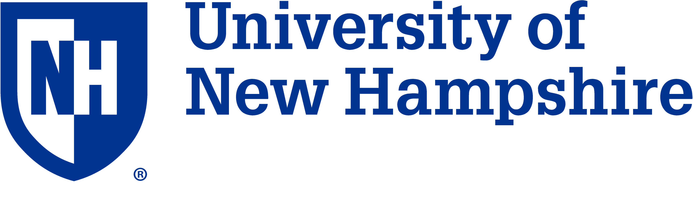

# Welcome to UNH Fullstack Community

 

## Content

- [Slack](https://fullstack-community.slack.com)
- [The Community](#the-community)
- [What we do](#what-we-do)
- [Membership](#membership)
- [Member Expectations](#member-expectations)
- [Github Repo](#github-repo)
- [Organizers](#organizers)

## Slack Workplace

    Join: https://fullstack-community.slack.com

## The Community

The Purpose of this community is to have a group of shared interest people who passionate about the web or web-based technologies, on and off browser. The community will share, discuss and demo fullstack technologies including different web and mobile frameworks, tools and libraries.

*This Community is an unofficial UNH club/organization/community. The community is open to public. We are currently seeking sponsors and partners to host meet-ups and events. Please contact the primary contact below for sponsorship.*

## What we do

1. Weekly meet-up

    * Weekly meet-up is hosted at Kingsbury Hall, UNH
    * Discuss, share and demo a tool or technology
    * Code is shared in this github for the topic that presented

2. Discuss, share and demo

    * Discuss about a specific tool, technology such as library or framework which is web based or web related, development dependencies
    * Share the experiences such as working experiences, job hunting, technology usage, configuration, your open-sourced projects
    * Demo is fun, as developers, we love it! At our meeting, our community member will volunteer to demo a specific tool. A demo is like a short tutorial, code along presentation. The purpose is to get your hands dirty with the tool, not just the theory

3. Request and Present

    * You can request a topic such as a specific tool/technology to be discussed
    * You can volunteer to present and run a demo for everyone to learn or code along
    * Volunteer to run a demo or request a topic to discuss here: [Access Google SpreadSheet](https://docs.google.com/spreadsheets/d/1DyWUfHVrVwqVLTdde8MBgucLCm9_Qykc2mNmS8L5Q6E/edit?usp=sharing)

    * Upcoming Topics to present (Schedule)

    | Topic Request | Demo | Presenter |
    | ------------- | ------------- | ------------- |
    | Node.js  | Intro Node.js, create a backend App w Node & JSON in 30 mins | Huy Le
    | Jekyll  | Making a portfolio site | Francisco Santana

## Membership

As this is an open community to everyone, enthusiasts of all skill levels are encouraged to participate. There is no requirement to become member. However, there are expectations for member within the community.

## Member Expectations

1. Contribution

    As the goal of our community is to grow together, we would expect the member to be active and contribute to the community by volunteering to present, run demos and help growing the community.

2. Sharing is carrying

    Another goal of our community is to share your knowledge, experiences, usage of tools in software development. There are many ways to help other community members such as sharing an article, a tutorial demo on our Slack tutorial shares channel.

3. Collaboration

    This community is a great place for passionate people to connect with each other to form a team for an innovation venture, or joning events such as Hackathon, coding contest. Feel free to reach out to anyone in the community on Slack workplace if you have questions.

## Github Repo

    Url: https://github.com/huyle93/unhfullstack

All tutorials, presentations or demos will be posted here in this github repo

## Organizers

- Huy Le, huy.helloworld@gmail.com Primary Contact
- Francisco Santana, F.santana3177@gmail.com
- Andreas Sudato, ab116893@gmail.com